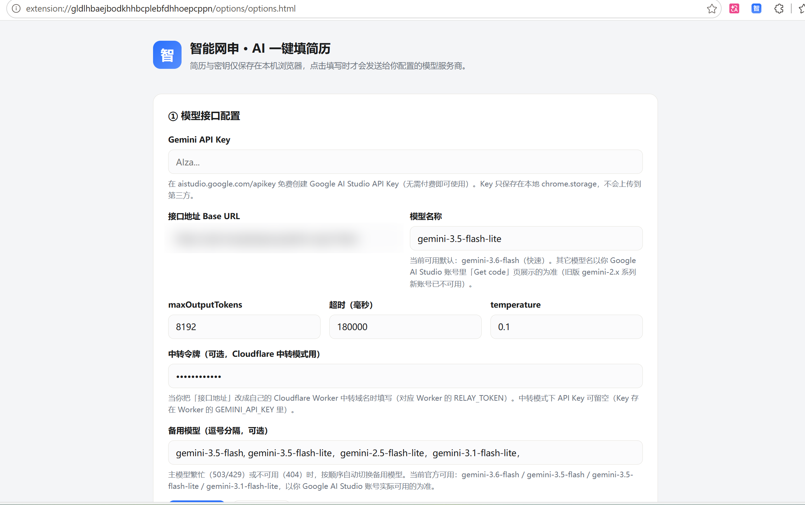

# 智能网申 - AI 一键填简历

> 把简历提前写好，剩下的交给 AI。Chrome 浏览器插件，自动识别招聘网站表单并一键填写。
>
> *Pre-write your resume once, let AI handle the rest. A Chrome extension that auto-detects job-site forms and fills them in one click.*




---

## ✨ 功能特性

- 🔍 **智能识别表单**：自动识别各大招聘网站的简历申请表单字段
- 🤖 **AI 语义匹配**：调用大模型把你的简历内容语义匹配到对应字段，而非生硬的关键词替换
- 🔑 **双模型支持**：DeepSeek 与 Gemini 双版本，按需选用
- 🌐 **免代理中转**：附带 Cloudflare Worker 中转代码，无代理也能免费用 Gemini
- 🔒 **数据不出本地**：简历只保存在浏览器本地，不上传任何第三方服务器
- ⚡ **一键填写**：识别 + 填写一次完成，重复投递时效率翻倍

---

## 📦 版本选型

| 版本 | 适用人群 | 是否需要代理 | 是否需要自己部署 |
| :--- | :--- | :--- | :--- |
| `smart-autofill-deepseek` | 已有 DeepSeek API Key | ❌ 不需要 | ❌ 装插件填 Key 即用 |
| `smart-autofill-gemini`（直连） | 已有代理 / 海外网络 | ✅ 需要 | ❌ 装插件填 Gemini Key |
| `smart-autofill-gemini`（中转） | 无代理、想免费用 Gemini | ❌ 不需要 | ✅ 需部署 Cloudflare Worker（本 README 有全程网页版教程） |

---

## 🚀 快速开始

Chrome 系浏览器均适用（Chrome / Edge / Arc 等）。三个版本安装方式相同：

1. 打开 `chrome://extensions`，右上角开启**开发者模式**
2. 点**加载已解压的扩展程序**，选择对应版本的文件夹：
   - DeepSeek 版 → `smart-autofill-deepseek/`
   - Gemini 版 → `smart-autofill-gemini/smart-autofill/`（或你下载目录下对应的 Gemini 文件夹）
3. 打开插件，在设置里填入 API Key（或中转地址，见下文），打开任意招聘网站开始一键填写

---

## 🗂️ 目录结构

```
.
├── smart-autofill-deepseek/      # DeepSeek 版本插件源码（manifest v1.0.0）
├── smart-autofill-gemini/        # Gemini 版本插件源码（manifest v1.4.0，支持中转令牌）
│   └── smart-autofill/
├── gemini-api-relay/             # Cloudflare Worker 中转代码（免代理访问 Gemini）
│   └── gemini-api-relay/
│       └── worker.js
├── LICENSE                       # Unlicense
└── README.md
```

> ⚠️ 注意：目录名中的空格、括号（如 `smart-autofill-gemini (3)`）是下载时自动加的，建议重命名为上方所示的干净名称，避免路径引用出错。

---

## 🔧 配置与部署

### Gemini 直连模式（需代理）

插件「设置」→ 模型接口配置：

| 项目 | 值 |
| :--- | :--- |
| 接口地址 Base URL | `https://generativelanguage.googleapis.com/v1beta` |
| API Key | 填你的 Gemini Key（[aistudio.google.com/apikey](https://aistudio.google.com/apikey) 免费创建） |

### Gemini 中转模式（免代理，需先部署 Worker）

**前置条件**：一个已接入 Cloudflare 的域名（DNS 托管在 Cloudflare，橙云代理状态）+ 一个 Gemini API Key。

**1️⃣ 创建 Worker**：Cloudflare 控制台 → Workers & Pages → Create → Create Worker → 输入名称（如 `gemini-api-relay`）→ Deploy → Edit code

**2️⃣ 粘贴中转代码**：删掉编辑器默认代码，把 `gemini-api-relay/gemini-api-relay/worker.js` 的内容全选复制粘贴进去 → Deploy

**3️⃣ 配置密钥**（推荐）：Worker 详情页 → Settings → Variables and Secrets → Add

| 类型 | 名称 | 值 |
| :--- | :--- | :--- |
| Secret | `GEMINI_API_KEY` | 你的 Gemini API Key（形如 `AIza...`） |
| Secret | `RELAY_TOKEN` | 你自己设的强口令（如 `Gh2026#relay`，防他人蹭配额） |

- **模式 A（推荐）**：配置 `GEMINI_API_KEY` + `RELAY_TOKEN`。插件里 API Key 留空，只填「中转令牌」；Key 只存在你自己的 Cloudflare 账号里。
- **模式 B（透传）**：两者都不配，插件里照常填 Gemini API Key，由 Worker 原样转发。

**4️⃣ 绑定域名**：Worker 详情页 → Settings → Domains & Routes → Add → Custom Domain → 输入子域名（如 `api.example.com`）→ Activate（Cloudflare 自动创建 DNS 记录）

**5️⃣ 测试**：

```bash
curl -X POST https://api.example.com/v1beta/models/gemini-2.5-flash:generateContent \
  -H "Content-Type: application/json" \
  -H "x-relay-token: 你的令牌" \
  -d '{"contents":[{"role":"user","parts":[{"text":"ping，只回复 pong"}]}],"generationConfig":{"maxOutputTokens":256}}'
```

返回 `pong` 即成功 ✅

**插件侧配置**（打开插件「设置」→ 模型接口，需插件版本 ≥ 1.3.0 才支持「中转令牌」输入框）：

| 项目 | 中转模式填法 |
| :--- | :--- |
| 接口地址 Base URL | `https://你的域名/v1beta` |
| API Key | 模式 A 留空；模式 B 照常填 |
| 中转令牌 | 模式 A 填 `RELAY_TOKEN`；模式 B 留空 |

保存后点「测试连接」即可。

**备用：wrangler CLI 部署**（不想用网页版可用命令行）：

```bash
npm install -g wrangler
cd gemini-api-relay/gemini-api-relay
wrangler login
wrangler secret put GEMINI_API_KEY
wrangler secret put RELAY_TOKEN
wrangler deploy
```

---

## ⚙️ 工作原理

插件通过**你自己的域名**访问 Gemini，本机不再需要开代理。请求先打到 Cloudflare 边缘服务器（全球节点，可直连 Google），再由 Worker 代你转发给 Gemini 官方接口。

```
浏览器插件 ──HTTPS──> 你的域名 (Cloudflare Worker) ──> Google Gemini API
                              ↑
                    边缘节点代发请求，本机无需代理
```

> **为什么不能用「静态网页」中转？**
> 静态网页（纯 HTML/JS）的请求仍是从**你的浏览器本机**发出的，直连 Google 一样会被阻断。只有 Worker 这类**服务端代理**，才能借 Cloudflare 的服务器访问 Google。所以部署的是 Worker，而不是普通网页。

---

## ❓ 常见问题

| 现象 | 原因与处理 |
| :--- | :--- |
| 返回 404 | 路径不是 `/v1beta/` 开头；确认插件 Base URL 以 `/v1beta` 结尾 |
| 返回 401 | `x-relay-token` 与 `RELAY_TOKEN` 不一致；或未在插件里填令牌 |
| 返回 400「缺少 x-goog-api-key」 | 模式 A 忘了在 Worker 配 `GEMINI_API_KEY`，或模式 B 插件里没填 API Key |
| 返回 502 | Worker 到 Google 失败：多为 Key 无效，或临时网络抖动，稍后再试 |
| 返回 503 | Gemini 官方模型高峰过载（插件已自动重试 3 次），稍后重试即可 |
| 绑定域名失败 | 确认该域名在 Cloudflare 是橙云（代理）状态；子域名没被其他记录占用 |

---

## 📊 Gemini 免费模型与额度

> ⏰ **最后更新：2026 年 9 月**。Google 会不定期调整免费额度且不另行通知，准确数字请以 AI Studio → Rate Limit → All models 页面实时显示为准。

以下为 Google AI Studio 免费层（Free Tier）下仍具备可用额度的**文本模型**，按每日可用量从高到低排列：

| 模型 ID | RPM 次/分钟 | TPM token/分钟 | RPD 次/天 | 上下文 | 说明 |
| :--- | :---: | :---: | :---: | :---: | :--- |
| `gemini-2.5-flash-lite` | 15 | 250K | **500** | 1M | 🥇 免费层首选，额度最高 |
| `gemini-2.0-flash-lite` | 15 | 250K | **500** | 1M | 🥈 同额度备选 |

几点提醒：

- **真正卡住你的是 RPD（每日请求数）**：标准 Flash 每天只有约 20 次，填几份简历就会耗尽；Flash-Lite 有 500 次。**强烈建议把插件默认模型设为 flash-lite 系列**。
- **Pro 系列已不免费**：自 2026 年 4 月起，Pro 模型在免费层的额度为 0，必须绑定结算账号。
- **额度算在项目上，不是 Key 上**：同一项目多申请几个 Key，总额度不会变多。
- **免费层的代价**：免费层的输入输出可能被 Google 用于改进模型；若介意简历等敏感信息，请升级付费层或改用本地模型。
- 触发 429 时先看错误体是哪项超限：RPM 超限等 60 秒重试；TPM 超限拆分请求或换小模型；RPD 超限等到**太平洋时间午夜**重置。

---

## 🔐 隐私与安全

- **简历数据仅存本地**：你的个人信息保存在浏览器本地存储，不上传到任何第三方服务器。
- **中转链路干净**：中转模式下，简历内容经**你自己的域名**转发给 Google，中间不经过任何第三方，全程 HTTPS。
- **防蹭配额**：配置 `RELAY_TOKEN` 后，没有令牌的人无法调用你的 Worker。
- **Key 存放**：模式 A 下 Gemini Key 只存在 Cloudflare 环境变量（加密存储），插件本地不保存 Key。
- **免费额度**：Cloudflare Workers 免费版每天 10 万次请求，个人使用绰绰有余。

---

## 📄 License

本项目基于 [Unlicense](LICENSE) 发布到公有领域，可自由使用、修改、分发。
